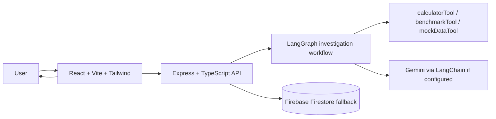

# MORPHOS — Autonomous AI Experimentation Platform

MORPHOS is an autonomous AI experimentation platform that takes a technical investigation question, formulates hypotheses, runs simulated experiments, and synthesizes a reasoning-based conclusion. It uses a real LangGraph state machine to make the workflow visible and stateful instead of acting like a simple chatbot.

## Architecture diagram



## Tech stack

- Frontend: React, Vite, TypeScript, Tailwind CSS
- Backend: Node.js, Express, TypeScript
- AI orchestration: LangChain, LangGraph, Gemini/Groq-ready model integration
- Data: Firebase Firestore (with local dev fallback)
- Deployment: Docker, Google Cloud Run, Firebase Hosting preparation
- Source control: Git, GitHub

## Features

- Stateful workflow with LangGraph and iterative investigation loops
- Structured hypothesis generation from the user question
- Experiment execution with built-in simulated tools
- Confidence scoring and iteration control
- API with health and investigation endpoints
- Frontend dashboard showing the agent timeline and findings
- Firebase integration with graceful fallback for local development
- Docker support for Cloud Run deployment

## LangGraph workflow explanation

The backend graph follows this flow:

1. interpretQuestion
2. generateHypotheses
3. selectExperiment
4. executeExperiment
5. analyzeResults
6. evaluateConfidence
7. finalize when the confidence threshold is reached, otherwise loop back to hypothesis generation

The state includes question, interpretedProblem, hypotheses, selectedHypothesis, experiment, experimentResult, analysis, confidence, iteration, maxIterations, events, finalConclusion, and status. A safe maximum iteration count prevents infinite loops.

## LangChain usage

The project demonstrates actual LangChain tooling:

- Chat model integration with Gemini when an API key is supplied
- Structured output generation for hypothesis creation
- Prompt templates for investigation planning
- Tool integration through calculatorTool, benchmarkTool, and mockDataTool

If no Gemini key is configured, the app falls back to deterministic simulation logic so the workflow still runs locally without external API access.

## Firebase architecture

The app is prepared for Firebase Authentication and Firestore. The implementation includes a storage layer with a clean development fallback when credentials are unavailable. The expected collections are:

- users
- investigations
- experiments
- findings

Investigation records include question, hypotheses, experiments, analysis, confidence, finalConclusion, and timestamps.

## GCP architecture

The backend is prepared for Google Cloud Run deployment via Docker. The frontend can be deployed to Firebase Hosting or any static host. The deployment pattern is:

- Backend container on Cloud Run
- Frontend static bundle served from Firebase Hosting or Vite preview build
- Firebase credentials kept in environment variables and not committed to source control

## Local setup

1. Install dependencies:
   ```bash
   npm install
   ```

2. Copy the environment file:
   ```bash
   cp .env.example .env
   ```

3. Update the values in `.env` with your actual keys if needed.

4. Start the backend:
   ```bash
   npm run dev --workspace backend
   ```

5. Start the frontend:
   ```bash
   npm run dev --workspace frontend
   ```

6. Open the app in the browser:
   - Frontend: http://localhost:5173
   - Backend API: http://localhost:4000/api

## Environment variables

Required for local development:

```env
PORT=4000
FRONTEND_ORIGIN=http://localhost:5173
GEMINI_API_KEY=your_gemini_api_key
```

Optional Firebase setup:

```env
FIREBASE_PROJECT_ID=your_firebase_project_id
FIREBASE_API_KEY=your_firebase_api_key
FIREBASE_AUTH_DOMAIN=your_project.firebaseapp.com
FIREBASE_STORAGE_BUCKET=your_project.appspot.com
FIREBASE_MESSAGING_SENDER_ID=1234567890
FIREBASE_APP_ID=your_firebase_app_id
FIREBASE_MEASUREMENT_ID=G-XXXXXXXXXX
```

## Demo examples

Use these example questions with the dashboard or API:

- Why is API latency increasing?
- Why does database performance degrade with increasing traffic?
- Why is memory usage growing over time?
- Why does processing time increase dramatically as dataset size grows?

## Deployment instructions

### Backend on Cloud Run

```bash
cd backend
docker build -t morphos-backend .
```

Then deploy with gcloud:

```bash
gcloud run deploy morphos-backend --source . --region us-central1 --allow-unauthenticated
```

### Frontend

```bash
cd frontend
npm run build
```

The resulting static bundle in `frontend/dist` can be deployed to Firebase Hosting or any static host.

## Future improvements

- Add actual Firebase authentication and protected project dashboards
- Add a richer experiment library with real telemetry connectors
- Add a persistent conversation and investigation history feed
- Add artifact export and PDF summaries
- Integrate more AI model providers and tool execution frameworks

## Notes

The MVP intentionally uses simulated performance experiments for local development and demonstration purposes, while the architecture is structured so real tools and services can be added later without rewriting the workflow.
