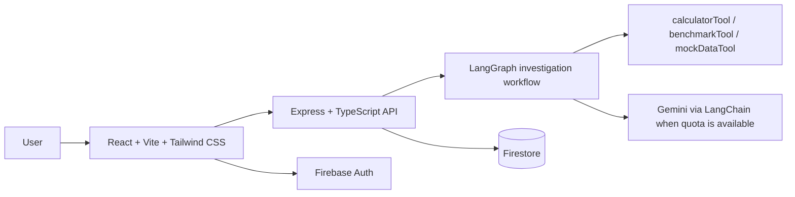

# MORPHOS

Autonomous AI Experimentation Platform

"An AI system that learns by experimenting."

MORPHOS is a local-first AI investigation platform for technical problem-solving. It combines a React dashboard, an Express API, Firebase Authentication, Firestore persistence, and a LangGraph-driven investigation workflow to turn a user question into a structured, hypothesis-based analysis flow.

## Overview

The platform is designed to help users investigate complex technical issues through a repeatable loop:

1. Interpret the question
2. Generate candidate hypotheses
3. Select an experiment strategy
4. Run the experiment
5. Analyze results
6. Score confidence
7. Finalize the conclusion or continue iterating

This makes the system more transparent than a typical chatbot because each stage is observable and stateful.

## Problem

Modern technical investigations often involve ambiguity, incomplete information, and iterative hypothesis testing. Many AI tools produce vague answers without clearly showing how they reasoned or which experiments they considered. MORPHOS addresses that by formalizing the workflow as an evidence-driven investigation system.

## Features

- LangGraph-based investigation workflow with stateful transitions
- Structured hypothesis generation and confidence scoring
- Experiment execution through deterministic, tool-driven simulation
- Firebase Email/Password authentication
- Firestore-backed investigation persistence
- Authenticated per-user investigation history
- React + Vite frontend with lifecycle timeline and result panels
- Express backend with health and API routes
- Gemini integration when quota allows, with graceful fallback mode otherwise
- Security-conscious env handling with secrets kept out of source control

## Architecture



## LangChain + LangGraph workflow

The backend investigation graph follows a repeatable and observable investigation lifecycle:

1. interpretQuestion
2. generateHypotheses
3. selectExperiment
4. executeExperiment
5. analyzeResults
6. evaluateConfidence
7. finalize

The workflow stores structured state including:
- question
- interpretedProblem
- hypotheses
- selectedHypothesis
- experiment
- experimentResult
- analysis
- confidence
- iteration
- maxIterations
- events
- finalConclusion
- status

A safe iteration cap prevents runaway loops during local development and demo usage.

## Firebase Authentication

MORPHOS supports Firebase Email/Password authentication on the frontend and verifies Firebase ID tokens on the backend before processing investigation requests.

Behavior:
- User registers or logs in with Firebase client SDK
- Client gets a Firebase ID token
- Backend reads the Authorization header and verifies the token with Firebase Admin SDK
- The decoded UID is used as the real ownership source for persistence and history access

This ensures the app does not trust a user-provided UID in the request body.

## Firestore persistence

Investigation records are stored in Firestore using the authenticated UID as the ownership key. The backend persists structured results and exposes history endpoints that return only the current user’s records.

Important note:
- Real Firestore write and read functionality has been verified in the local environment.
- Firestore rules are present in the repository, but their deployment and runtime testing remain separate from the app code and are not claimed as verified unless the Firebase CLI deployment is completed.

## React + Vite frontend

The frontend is a single-page app built with React and Vite. It includes:
- authentication state
- investigation input
- workflow timeline
- current hypothesis view
- investigation history list
- result and final conclusion panels

## Express backend

The backend exposes:
- health endpoint
- investigation execution endpoint
- investigation history endpoint
- authenticated investigation detail access

It is designed to keep the AI workflow and API concerns separate while still supporting local development and real Firebase-backed ownership enforcement.

## Gemini integration

Gemini is integrated through LangChain, but the current runtime limitation is free-tier quota exhaustion. When the provider is unavailable, the app retains deterministic local behavior so the workflow continues without failing the application itself.

Current status:
- LangChain integration is present and working
- LangGraph workflow remains intact
- Tool execution remains intact
- Gemini live calls are currently blocked by provider quota exhaustion (HTTP 429)

The application clearly reports this availability problem instead of pretending the live model is operational.

## Experiment and tool system

The investigation graph executes deterministic experiment flows via built-in tools such as:
- calculatorTool
- benchmarkTool
- mockDataTool

These simulate technical investigation paths so the platform remains testable and usable even when an external LLM provider is unavailable.

## Project structure

```text
.
├── .env.example
├── .gitignore
├── README.md
├── firestore.rules
├── package.json
├── package-lock.json
├── backend/
│   ├── Dockerfile
│   ├── package.json
│   ├── src/
│   │   ├── agents/
│   │   ├── config.ts
│   │   ├── routes/
│   │   ├── server.ts
│   │   └── services/
│   └── tsconfig.json
├── frontend/
│   ├── package.json
│   ├── src/
│   ├── index.html
│   ├── vite.config.ts
│   └── tsconfig.json
└── docker-compose.yml
```

## Local setup

1. Install dependencies:

```bash
npm install
```

2. Create a local env file from the example:

```bash
cp .env.example .env
```

3. Fill in any required values locally as needed for your Firebase and Gemini configuration.

4. Start the backend:

```bash
npm run dev --workspace backend
```

5. Start the frontend:

```bash
npm run dev --workspace frontend
```

6. Open the app locally in the browser:
- Frontend: http://localhost:5173
- Backend: http://localhost:4000/api

## Environment variables

Use only locally managed values and keep secrets out of source control.

```env
PORT=4000
FRONTEND_ORIGIN=http://localhost:5173
GEMINI_API_KEY=your_gemini_api_key
FIREBASE_PROJECT_ID=your_firebase_project_id
FIREBASE_API_KEY=your_firebase_api_key
FIREBASE_AUTH_DOMAIN=your_project.firebaseapp.com
FIREBASE_STORAGE_BUCKET=your_project.appspot.com
FIREBASE_MESSAGING_SENDER_ID=1234567890
FIREBASE_APP_ID=your_firebase_app_id
FIREBASE_MEASUREMENT_ID=G-XXXXXXXXXX
```

No private keys or service-account JSON should be committed to the repository.

## API endpoints

### Health

```http
GET /api/health
```

### Investigate

```http
POST /api/investigate
Authorization: Bearer <firebase-id-token>
Content-Type: application/json
```

Body:

```json
{
  "question": "Why is API latency increasing?"
}
```

### Investigation history

```http
GET /api/investigations
Authorization: Bearer <firebase-id-token>
```

## Security

- Secret values are kept in local environment files and ignored by Git
- Firebase Admin credentials are never exposed to the frontend
- Backend token verification is required for authenticated routes
- Ownership is derived from the verified Firebase UID rather than request data
- No secrets or private keys are committed to source control

## Current limitations

- Gemini free-tier quota exhaustion can temporarily block live LLM access
- Firestore security rules are present in the repo but require Firebase CLI deployment and runtime validation before being claimed as deployed
- Local demo behavior intentionally uses deterministic tool execution when external AI is unavailable

## Future improvements

- Connect to more real telemetry sources and observability pipelines
- Add richer experiment strategy libraries
- Expand Firestore rules and production deployment validation
- Add more artifact export and reporting tooling
- Support additional AI providers with graceful fallback chaining

## Notes

This project is intentionally structured so the investigation engine, authentication layer, and persistence model can evolve without rewriting the core workflow. The current verified state is a working local platform with Firebase-backed auth and Firestore persistence, while the live Gemini provider remains constrained by quota availability.
